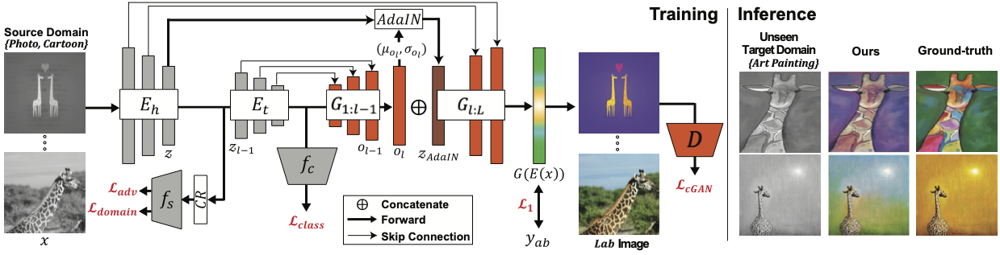
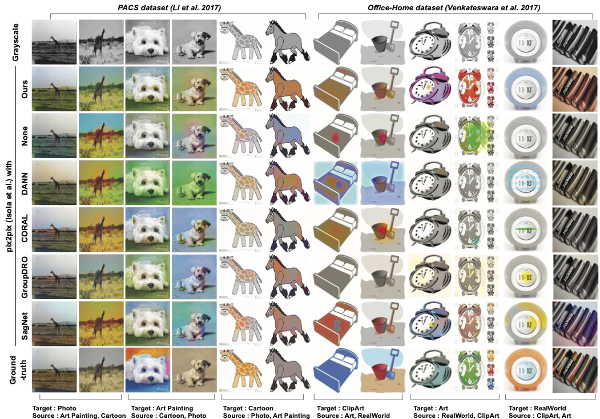

# Bridging the Domain Gap towards Generalization in Automatic Colorization
This is pytorch impelementation of "Bridging the Domain Gap towards Generalization in Automatic Colorization", Hyejin Lee, Deahee Kim, DaEun Lee, Jinkyu Kim, Jaekoo Lee, ECCV 2022
[paper] (update soon)

## Overview


### Main Architecture



### Output



## Dataset
We use PACS, Office-Home Dataset. Dataset Structure is provided below.\
We split examples from training domains in the ratio 8:2 (train:validation) \
Please prepare following this structure. 

If you want to split dataset, you can refer to our code (utils.py - split_domain_data function) 

PACS Dataset : https://domaingeneralization.github.io/

Office-Home Dataset : https://www.hemanthdv.org/officeHomeDataset.html

```bash
|--Dataset root
|   |-- Domain1 (ex: Photo)
|   |   |-- Class1 (ex: Dog)
|   |   |   |-- img1.jpg
|   |   |   |-- ...
|   |   |-- ...
|   |-- Domain2
|   |   |--Class1
|   |   |--...
|   |-- ...
|   |-- Train
|   |   |-- Domain1
|   |   |   |-- Class1
|   |   |   |   |-- img1.jpg
|   |   |   |   |--...
|   |   |   |--...
|   |   |-- Domain2
|   |   |   |-- Class1
|   |   |-- ...
|   |-- Valid
|   |   |-- Domain1
|   |   |   |-- Class1
|   |   |   |   |-- img1.jpg
|   |   |   |   |-- ...
|   |   |   |-- ...
|   |   |-- Domain2
|   |   |   |-- Class1
|   |   |-- ...
```


## Requirements & Environment
we used one RTX 3090 GPU for model training. and we also tested V100 GPU and A6000 GPU.

```
pip install -r requirements.txt
```

In particular, ensure that the version of Pytorch 1.7+, python 3.8+, cuda 11.0+


## Train

Run the following command to train the DG colorization Model
```
python train.py --config CONFIG --save_dir SAVE_DIR --w-adv [coefficient of adv loss] --gpu [gpu number]
```


## Test
Run the following comman to test the model
```
python test.py --h_model_path [head encoder model.pth] --t_model_path [tail encoder model.pth] --d_model_path [decoder model.pth] \
               --source [source domain name] --domain [target domain name] \
               --data_dir [testset root] --save_dir  [path to save] \
               --gpu [gpu number]
```
Dataset Structure is provided below. Please input dataset root path in 'data_dir' argument.
```bash
|--Dataset dataset root
|   |-- Domain1 (ex: Photo)
|   |   |-- Class1 (ex: Dog)
|   |   |   |-- img1.jpg
|   |   |   |-- ...
|   |   |-- ...
|   |-- Domain2
|   |   |--Class1
|   |   |--...
|   |-- ...
```

## Citation
update soon